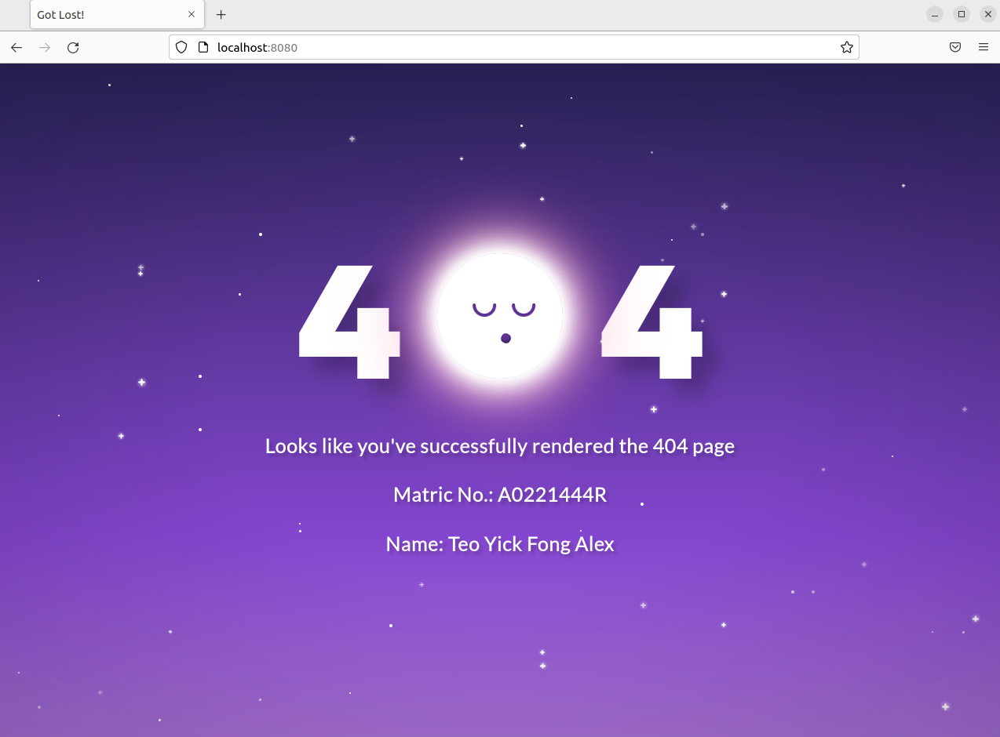

Name: Teo Yick Fong Alex

Student Number: A0221444R

[Github Repo](https://github.com/alexteo98/OTOT-A1)

## Task A1.1 
### Runing the node app
1. `cd app`
1. Build the docker image
    1. `docker build ./ -t node-web-app`
    1. Alternatively, use the `./build.sh` script to build
    1. sudo privillages might be required
1. Run the docker container
    1. `docker run -p 3000:8080 -d --name otot-a1-1 node-web-app`
    1. Alternatively, use the `./start.sh` script to start
    1. sudo privillages might be required
1. Visit the node app at [localhost:3000](http://localhost:3000)

### Removing the node app
1. Stop the Docker container
    1. `docker stop otot-a1-1`
1. Remove the Docker container
    1. `docker rm otot-a1-1`
1. Remove the Docker image
    1. `docker image rm node-web-app`
1. sudo privillages might be required
1. Alternatively, use the `./remove.sh` script to remove

## Task A1.2
### Running the Nginx web server
1. `cd nginx-sample`
1. Build the docker image
    1. `docker build ./ -t nginx-server`
    1. Alternatively, use the `./build.sh` script to build
    1. sudo privillages might be required
1. Run the docker container
    1. `docker run -d -p 8080:80 --name otot-a1-2 nginx-server`
    1. Alternatively, use the `./start.sh` script to start
    1. sudo privillages might be required
1. Visit the web server at [localhost:8080](http://localhost:8080)

### Removing the web server
1. Stop the Docker container
    1. `docker stop otot-a1-2`
1. Remove the Docker container
    1. `docker rm otot-a1-2`
1. Remove the Docker image
    1. `docker image rm nginx-server`
1. sudo privillages might be required
1. Alternatively, use the `./remove.sh` script to remove

## Task A1.3 
### Running the Nginx reverse proxy
1. `cd nginx`
1. Build and run the docker containers
    1. `docker compose up --build`
    1. sudo privillages might be required
    1. Alternatively, use the `./start.sh` script to start
    1. Visit the node app at both [localhost:8080](http://localhost:8080) and [localhost:80](http://localhost:80)

